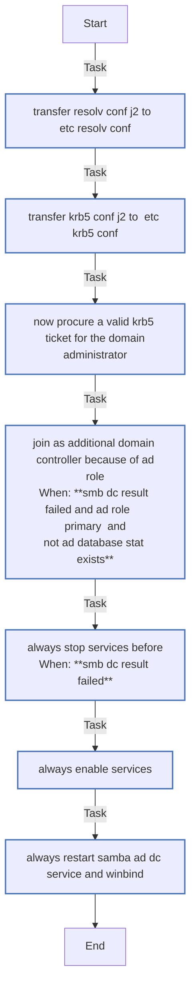
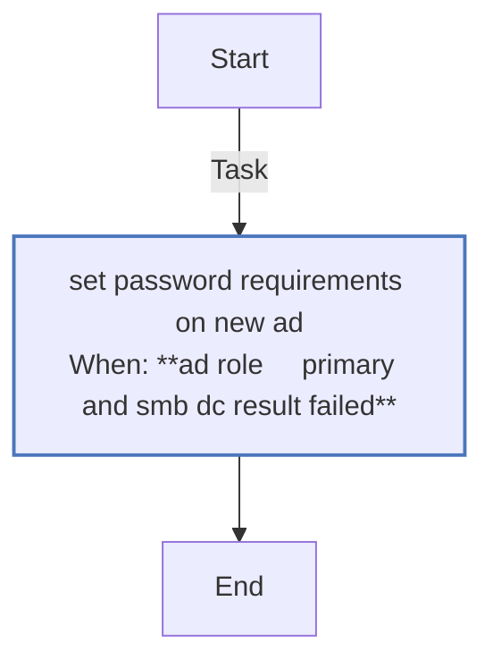

<!-- DOCSIBLE START -->

# 📃 Role overview

## waal70.samba_ad_dc

Description: Role to configure samba-based active directory (primary and secondary instance)

### Defaults

*These are static variables with lower priority

#### File: defaults/main.yml

| Var | Type | Value |
| -------------- | -------------- | ------------- |
| [ad_role](defaults/main.yml#L30) | str | `additional` |
| [force_sysvol_rsync](defaults/main.yml#L31) | bool | `False` |
| [smb_workgroup](defaults/main.yml#L35) | str | `WORKGROUP` |
| [smb_realm](defaults/main.yml#L36) | str | `WORKGROUP.LOCAL` |
| [smb_dns_servers](defaults/main.yml#L37) | str | `{{ ansible_facts['default_ipv4'].address }}` |
| [fallback_dns](defaults/main.yml#L39) | str | `8.8.8.8 8.8.4.4` |
| [smb_username](defaults/main.yml#L40) | str | `Administrator` |
| [smb_password](defaults/main.yml#L41) | str | `{{ vault_smb_password }}` |
| [smb_site](defaults/main.yml#L42) | str | `Sitename` |
| [smb_rsyncd_pass](defaults/main.yml#L44) | str | `{{ vault_smb_password }}` |

### Vars

*These are variables with higher priority

#### File: vars/main.yml

| Var | Type | Value |
| -------------- | -------------- | ------------- |
| [vault_smb_password](vars/main.yml#L5) | str | `ENCRYPTED_WITHansible_vault` |
| [vault_smb_rsync_pass](vars/main.yml#L13) | str | `ENCRYPTED_WITHansible_vault` |

### Tasks

#### File: tasks/additional.yml

| Name | Module | Has Conditions |
| ---- | ------ | -------------- |
| Transfer resolv.conf.j2 to /etc/resolv.conf | ansible.builtin.template | False |
| Transfer krb5.conf.j2 to /etc/krb5.conf | ansible.builtin.template | False |
| Now procure a valid krb5 ticket for the domain administrator | ansible.builtin.command | False |
| Join as additional domain controller because of ad_role | ansible.builtin.command | True |
| Always stop services before | ansible.builtin.systemd_service | True |
| Always Enable Services | ansible.builtin.systemd_service | False |
| Always restart samba-ad-dc.service and winbind | ansible.builtin.systemd_service | False |

#### File: tasks/main.yml

| Name | Module | Has Conditions | Comments |
| ---- | ------ | -------------- | -------- |
| Include vaulted password file | ansible.builtin.include_vars | False | This include_vars allows you to keep your vaulted variables outside of your main repo. It assumes the PRIVATE_REPO environment variable is set to the path of your private repo. On home-infra, this is done by firstrun.sh. However, this role will not break if you do not have these |
| Assert this host must have a ad_role defined and be in the activedirectory group | ansible.builtin.assert | False | |
| Set this host's ad_role into a fact | ansible.builtin.set_fact | False | |
| Set this host's dns_forwarder into a fact | ansible.builtin.set_fact | False | |
| Print the Active Directory role for {{ inventory_hostname }} | ansible.builtin.debug | False | |
| No matter this host's AD-role, some tasks should always be done | ansible.builtin.import_tasks | False | |
| Import the tasks that are needed for primary AD DC's | ansible.builtin.import_tasks | True | |
| For Debian bookworm - additional | ansible.builtin.import_tasks | True | |
| Checking whether all configured Active Directories are up and running | block | False | |
| Check whether there is samba-ad-dc configured for {{ inventory_hostname }} | ansible.builtin.command | False | |
| Set switch to confirm all AD's mentioned in the inventory are alive | ansible.builtin.set_fact | False | |
| Create the rsync-secrets file and give proper permissions | ansible.builtin.template | True | |
| Check whether crontab was already set | ansible.builtin.lineinfile | True | |
| Import tasks to set sysvol sync, but only when the additional has been provisioned | ansible.builtin.import_tasks | True | Skipping SysVol sync setup as it is time-consuming. Should it not be setup (correctly), you can force the run of this task by clearing root's crontab on the additional (crontab -r)or by setting force_sysvol_rsync to true |

#### File: tasks/primary.yml

| Name | Module | Has Conditions |
| ---- | ------ | -------------- |
| Transfer resolv.conf.j2 to /etc/resolv.conf | ansible.builtin.template | False |
| Set {{ ansible_facts['hostname'] }} as primary domain controller because of ad_role={{ ad_role }} | ansible.builtin.command | True |
| Disable Services | ansible.builtin.systemd_service | True |
| Back-up the initial /etc/krb5.conf to /etc/krb5.conf.initial | ansible.builtin.copy | True |
| Copy /var/lib/samba/private/krb5.conf to /etc/krb5.conf | ansible.builtin.copy | False |
| Always Enable Services | ansible.builtin.systemd_service | False |
| Always restart samba-ad-dc.service | ansible.builtin.systemd_service | False |
| Ease up on the password requirements | ansible.builtin.import_tasks | False |

#### File: tasks/samba-passreqs.yml

| Name | Module | Has Conditions | Comments |
| ---- | ------ | -------------- | -------- |
| Set password requirements on new AD | ansible.builtin.command | True | title: password requirements |

#### File: tasks/shared.yml

| Name | Module | Has Conditions |
| ---- | ------ | -------------- |
| Block to disable services | block | False |
| Disable resolveconf | ansible.builtin.systemd_service | False |
| Build a correct hosts file for SAMBA DC's | ansible.builtin.lineinfile | True |
| Check whether there is already samba-ad-dc configured for {{ inventory_hostname }} | ansible.builtin.command | False |
| Install dependencies | ansible.builtin.apt | False |
| Preseed PAM Configuration | ansible.builtin.raw | True |
| Remove (old) Samba configuration, but only if this is not already a samba domain | ansible.builtin.file | True |
| Transfer smb.conf.j2 to /etc/samba/smb.conf | ansible.builtin.template | False |
| Get a list of all IP addresses of all DNS servers from the inventory | ansible.builtin.set_fact | False |
| Back-up the initial /etc/krb5.conf to /etc/krb5.conf.initial | ansible.builtin.copy | False |
| Edit fstab | ansible.builtin.replace | False |
| Check whether the AD database exists | ansible.builtin.stat | False |

#### File: tasks/sysvol-sync.yml

| Name | Module | Has Conditions | Comments |
| ---- | ------ | -------------- | -------- |
| Ensure rsync is installed. Needed for posix.synchronize and the sysvol replication | ansible.builtin.apt | False | title: role-samba-ad-dc |

Author: André
Version: 1.0
File: tasks/sysvol-sync.yml

Pre-requisites: at least a primary and one additional DC.
Description: Sets up sysvol sync between the DC's |
| Backup the idmap database file | ansible.builtin.command | True |  |
| Fetch the idmap database file | ansible.builtin.fetch | True |  |
| Copy the idmap database file | ansible.builtin.copy | True |  |
| Now put in place the config for rsyncd | ansible.builtin.template | True |  |
| Create the secrets file and give proper permissions | ansible.builtin.template | True |  |
| Enable rsync services for {{ ansible_facts['hostname'] }} | ansible.builtin.systemd_service | True |  |
| Create the password file on additional {{ ansible_facts['hostname'] }} | ansible.builtin.copy | True |  |
| Dry run the rsync | ansible.builtin.command | True |  |
| Perform the rsync if dryrun was succesfull | ansible.builtin.command | True |  |
| Set the rsync as a cron-job on the additional servers. Run at 5:30 AM and 17:30 | ansible.builtin.cron | True |  |
| Reset the ACL on the additional servers. | ansible.builtin.command | True |  |

## Task Flow Graphs

### Graph for additional.yml



### Graph for main.yml

```mermaid
flowchart TD
Start
classDef block stroke:#3498db,stroke-width:2px;
classDef task stroke:#4b76bb,stroke-width:2px;
classDef includeTasks stroke:#16a085,stroke-width:2px;
classDef importTasks stroke:#34495e,stroke-width:2px;
classDef includeRole stroke:#2980b9,stroke-width:2px;
classDef importRole stroke:#699ba7,stroke-width:2px;
classDef includeVars stroke:#8e44ad,stroke-width:2px;
classDef rescue stroke:#665352,stroke-width:2px;

  Start-->|Include vars| Include_vaulted_password_file____item____0[include vaulted password file<br>include_vars:    item   ]:::includeVars
  Include_vaulted_password_file____item____0-->|Task| Assert_this_host_must_have_a_ad_role_defined_and_be_in_the_activedirectory_group1[assert this host must have a ad role defined and<br>be in the activedirectory group]:::task
  Assert_this_host_must_have_a_ad_role_defined_and_be_in_the_activedirectory_group1-->|Task| Set_this_host_s_ad_role_into_a_fact2[set this host s ad role into a fact]:::task
  Set_this_host_s_ad_role_into_a_fact2-->|Task| Set_this_host_s_dns_forwarder_into_a_fact3[set this host s dns forwarder into a fact]:::task
  Set_this_host_s_dns_forwarder_into_a_fact3-->|Task| Print_the_Active_Directory_role_for_inventory_hostname4[print the active directory role for inventory<br>hostname]:::task
  Print_the_Active_Directory_role_for_inventory_hostname4-->|Import task| No_matter_this_host_s_AD_role__some_tasks_should_always_be_done_shared_yml_5[/no matter this host s ad role  some tasks should<br>always be done<br>import_task: shared yml/]:::importTasks
  No_matter_this_host_s_AD_role__some_tasks_should_always_be_done_shared_yml_5-->|Import task| Import_the_tasks_that_are_needed_for_primary_AD_DC_s_primary_yml_6[/import the tasks that are needed for primary ad dc<br>s<br>When: **ad role     primary**<br>import_task: primary yml/]:::importTasks
  Import_the_tasks_that_are_needed_for_primary_AD_DC_s_primary_yml_6-->|Import task| For_Debian_bookworm___additional_additional_yml_7[/for debian bookworm   additional<br>When: **ad role     primary**<br>import_task: additional yml/]:::importTasks
  For_Debian_bookworm___additional_additional_yml_7-->|Block Start| Checking_whether_all_configured_Active_Directories_are_up_and_running8_block_start_0[[checking whether all configured active directories<br>are up and running]]:::block
  Checking_whether_all_configured_Active_Directories_are_up_and_running8_block_start_0-->|Task| Check_whether_there_is_samba_ad_dc_configured_for_inventory_hostname0[check whether there is samba ad dc configured for<br>inventory hostname]:::task
  Check_whether_there_is_samba_ad_dc_configured_for_inventory_hostname0-->|Task| Set_switch_to_confirm_all_AD_s_mentioned_in_the_inventory_are_alive1[set switch to confirm all ad s mentioned in the<br>inventory are alive]:::task
  Set_switch_to_confirm_all_AD_s_mentioned_in_the_inventory_are_alive1-.->|End of Block| Checking_whether_all_configured_Active_Directories_are_up_and_running8_block_start_0
  Set_switch_to_confirm_all_AD_s_mentioned_in_the_inventory_are_alive1-->|Rescue Start| Checking_whether_all_configured_Active_Directories_are_up_and_running8_rescue_start_0[checking whether all configured active directories<br>are up and running]:::rescue
  Checking_whether_all_configured_Active_Directories_are_up_and_running8_rescue_start_0-->|Task| Set_switch_in_case_one_of_the_inventory_AD_s_are_not_found_to_be_alive0[set switch in case one of the inventory ad s are<br>not found to be alive]:::task
  Set_switch_in_case_one_of_the_inventory_AD_s_are_not_found_to_be_alive0-.->|End of Rescue Block| Checking_whether_all_configured_Active_Directories_are_up_and_running8_block_start_0
  Set_switch_in_case_one_of_the_inventory_AD_s_are_not_found_to_be_alive0-->|Task| Create_the_rsync_secrets_file_and_give_proper_permissions9[create the rsync secrets file and give proper<br>permissions<br>When: **ad role     primary**]:::task
  Create_the_rsync_secrets_file_and_give_proper_permissions9-->|Task| Check_whether_crontab_was_already_set10[check whether crontab was already set<br>When: **ad role     primary**]:::task
  Check_whether_crontab_was_already_set10-->|Import task| Import_tasks_to_set_sysvol_sync__but_only_when_the_additional_has_been_provisioned_sysvol_sync_yml_11[/import tasks to set sysvol sync  but only when the<br>additional has been provisioned<br>When: **groups  activedirectory     length   1 and all ad<br>up   bool and  result primary changed   default<br>false   or  result secondary failed   default <br>false   or  force sysvol rsync   default false**<br>import_task: sysvol sync yml/]:::importTasks
  Import_tasks_to_set_sysvol_sync__but_only_when_the_additional_has_been_provisioned_sysvol_sync_yml_11-->End
```



### Graph for primary.yml

```mermaid
flowchart TD
Start
classDef block stroke:#3498db,stroke-width:2px;
classDef task stroke:#4b76bb,stroke-width:2px;
classDef includeTasks stroke:#16a085,stroke-width:2px;
classDef importTasks stroke:#34495e,stroke-width:2px;
classDef includeRole stroke:#2980b9,stroke-width:2px;
classDef importRole stroke:#699ba7,stroke-width:2px;
classDef includeVars stroke:#8e44ad,stroke-width:2px;
classDef rescue stroke:#665352,stroke-width:2px;

  Start-->|Task| Transfer_resolv_conf_j2_to__etc_resolv_conf0[transfer resolv conf j2 to  etc resolv conf]:::task
  Transfer_resolv_conf_j2_to__etc_resolv_conf0-->|Task| Set_ansible_facts['hostname']_as_primary_domain_controller_because_of_ad_role_ad_role1[set ansible hostname as primary domain controller<br>because of ad role ad role<br>When: **smb dc result failed and ad role   primary  and<br>not ad database stat exists**]:::task
  Set_ansible_facts['hostname']_as_primary_domain_controller_because_of_ad_role_ad_role1-->|Task| Disable_Services2[disable services<br>When: **smb dc result failed**]:::task
  Disable_Services2-->|Task| Back_up_the_initial__etc_krb5_conf_to__etc_krb5_conf_initial3[back up the initial  etc krb5 conf to  etc krb5<br>conf initial<br>When: **smb dc result failed**]:::task
  Back_up_the_initial__etc_krb5_conf_to__etc_krb5_conf_initial3-->|Task| Copy__var_lib_samba_private_krb5_conf_to__etc_krb5_conf4[copy  var lib samba private krb5 conf to  etc krb5<br>conf]:::task
  Copy__var_lib_samba_private_krb5_conf_to__etc_krb5_conf4-->|Task| Always_Enable_Services5[always enable services]:::task
  Always_Enable_Services5-->|Task| Always_restart_samba_ad_dc_service6[always restart samba ad dc service]:::task
  Always_restart_samba_ad_dc_service6-->|Import task| Ease_up_on_the_password_requirements_samba_passreqs_yml_7[/ease up on the password requirements<br>import_task: samba passreqs yml/]:::importTasks
  Ease_up_on_the_password_requirements_samba_passreqs_yml_7-->End
```

### Graph for samba-passreqs.yml



### Graph for shared.yml

```mermaid
flowchart TD
Start
classDef block stroke:#3498db,stroke-width:2px;
classDef task stroke:#4b76bb,stroke-width:2px;
classDef includeTasks stroke:#16a085,stroke-width:2px;
classDef importTasks stroke:#34495e,stroke-width:2px;
classDef includeRole stroke:#2980b9,stroke-width:2px;
classDef importRole stroke:#699ba7,stroke-width:2px;
classDef includeVars stroke:#8e44ad,stroke-width:2px;
classDef rescue stroke:#665352,stroke-width:2px;

  Start-->|Block Start| Block_to_disable_services0_block_start_0[[block to disable services]]:::block
  Block_to_disable_services0_block_start_0-->|Task| Disable_resolveconf0[disable resolveconf]:::task
  Disable_resolveconf0-.->|End of Block| Block_to_disable_services0_block_start_0
  Disable_resolveconf0-->|Rescue Start| Block_to_disable_services0_rescue_start_0[block to disable services]:::rescue
  Block_to_disable_services0_rescue_start_0-->|Task| Tell_the_user0[tell the user]:::task
  Tell_the_user0-.->|End of Rescue Block| Block_to_disable_services0_block_start_0
  Tell_the_user0-->|Task| Build_a_correct_hosts_file_for_SAMBA_DC_s1[build a correct hosts file for samba dc s<br>When: **hostvars item  ansible default ipv4 address is<br>defined**]:::task
  Build_a_correct_hosts_file_for_SAMBA_DC_s1-->|Task| Check_whether_there_is_already_samba_ad_dc_configured_for_inventory_hostname2[check whether there is already samba ad dc<br>configured for inventory hostname]:::task
  Check_whether_there_is_already_samba_ad_dc_configured_for_inventory_hostname2-->|Task| Install_dependencies3[install dependencies]:::task
  Install_dependencies3-->|Task| Preseed_PAM_Configuration4[preseed pam configuration<br>When: **smb dc result failed**]:::task
  Preseed_PAM_Configuration4-->|Task| Remove__old__Samba_configuration__but_only_if_this_is_not_already_a_samba_domain5[remove  old  samba configuration  but only if this<br>is not already a samba domain<br>When: **smb dc result failed**]:::task
  Remove__old__Samba_configuration__but_only_if_this_is_not_already_a_samba_domain5-->|Task| Transfer_smb_conf_j2_to__etc_samba_smb_conf6[transfer smb conf j2 to  etc samba smb conf]:::task
  Transfer_smb_conf_j2_to__etc_samba_smb_conf6-->|Task| Get_a_list_of_all_IP_addresses_of_all_DNS_servers_from_the_inventory7[get a list of all ip addresses of all dns servers<br>from the inventory]:::task
  Get_a_list_of_all_IP_addresses_of_all_DNS_servers_from_the_inventory7-->|Task| Back_up_the_initial__etc_krb5_conf_to__etc_krb5_conf_initial8[back up the initial  etc krb5 conf to  etc krb5<br>conf initial]:::task
  Back_up_the_initial__etc_krb5_conf_to__etc_krb5_conf_initial8-->|Task| Edit_fstab9[edit fstab]:::task
  Edit_fstab9-->|Task| Check_whether_the_AD_database_exists10[check whether the ad database exists]:::task
  Check_whether_the_AD_database_exists10-->End
```



### Graph for sysvol-sync.yml

```mermaid
flowchart TD
Start
classDef block stroke:#3498db,stroke-width:2px;
classDef task stroke:#4b76bb,stroke-width:2px;
classDef includeTasks stroke:#16a085,stroke-width:2px;
classDef importTasks stroke:#34495e,stroke-width:2px;
classDef includeRole stroke:#2980b9,stroke-width:2px;
classDef importRole stroke:#699ba7,stroke-width:2px;
classDef includeVars stroke:#8e44ad,stroke-width:2px;
classDef rescue stroke:#665352,stroke-width:2px;

  Start-->|Task| Ensure_rsync_is_installed__Needed_for_posix_synchronize_and_the_sysvol_replication0[ensure rsync is installed  needed for posix<br>synchronize and the sysvol replication]:::task
  Ensure_rsync_is_installed__Needed_for_posix_synchronize_and_the_sysvol_replication0-->|Task| Backup_the_idmap_database_file1[backup the idmap database file<br>When: **ad role     primary**]:::task
  Backup_the_idmap_database_file1-->|Task| Fetch_the_idmap_database_file2[fetch the idmap database file<br>When: **ad role     primary**]:::task
  Fetch_the_idmap_database_file2-->|Task| Copy_the_idmap_database_file3[copy the idmap database file<br>When: **ad role     primary**]:::task
  Copy_the_idmap_database_file3-->|Task| Now_put_in_place_the_config_for_rsyncd4[now put in place the config for rsyncd<br>When: **ad role     primary**]:::task
  Now_put_in_place_the_config_for_rsyncd4-->|Task| Create_the_secrets_file_and_give_proper_permissions5[create the secrets file and give proper<br>permissions<br>When: **ad role     primary**]:::task
  Create_the_secrets_file_and_give_proper_permissions5-->|Task| Enable_rsync_services_for_ansible_facts['hostname']6[enable rsync services for ansible hostname<br>When: **ad role     primary**]:::task
  Enable_rsync_services_for_ansible_facts['hostname']6-->|Task| Create_the_password_file_on_additional_ansible_facts['hostname']7[create the password file on additional ansible<br>hostname<br>When: **ad role     primary**]:::task
  Create_the_password_file_on_additional_ansible_facts['hostname']7-->|Task| Dry_run_the_rsync8[dry run the rsync<br>When: **ad role     primary**]:::task
  Dry_run_the_rsync8-->|Task| Perform_the_rsync_if_dryrun_was_succesfull9[perform the rsync if dryrun was succesfull<br>When: **ad role     primary  and not rsync dryrun failed  <br>default false**]:::task
  Perform_the_rsync_if_dryrun_was_succesfull9-->|Task| Set_the_rsync_as_a_cron_job_on_the_additional_servers__Run_at_5_30_AM_and_17_3010[set the rsync as a cron job on the additional<br>servers  run at 5 30 am and 17 30<br>When: **ad role     primary  and not rsync dryrun failed  <br>default false**]:::task
  Set_the_rsync_as_a_cron_job_on_the_additional_servers__Run_at_5_30_AM_and_17_3010-->|Task| Reset_the_ACL_on_the_additional_servers_11[reset the acl on the additional servers <br>When: **ad role     primary**]:::task
  Reset_the_ACL_on_the_additional_servers_11-->End
```

## Author Information

Unless otherwise noted, this entire repository is (c) 2024 by André (waal70). [See github profile](https://github.com/waal70)

Please contact me if you need a commercial license for any of these files

### License

[GPLv3](https://www.gnu.org/licenses/gpl-3.0.html#license-text)

#### Minimum Ansible Version

2.1

#### Platforms

- **Debian**: ['bookworm']

#### Dependencies

No dependencies specified.
<!-- DOCSIBLE END -->
